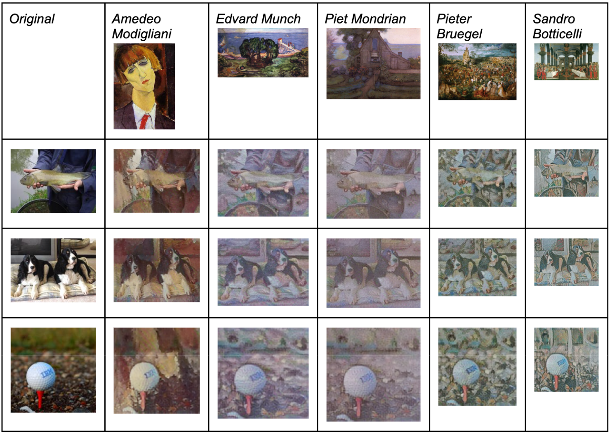

# Neural Style Transfer for Improved Object Detection

[Read my write-up!]([url](https://docs.google.com/document/d/1hd2KBQsvwObmYqkbwON-0IAmROAVXkK0nj-tWbZXeGk/edit?usp=sharing))

## Summary
Using neural style transfer (NST) to generate additional training samples can improve the generalizability of convolutional neural networks (CNNs) for object detection tasks.

## Dataset
- Base images from Imagenette (subset of ImageNet)
- 10 object classes: chainsaw, gas pump, tench, french_horn, church, english_springer, golf ball, garbage truck, parachute, cassette player
- Source: https://github.com/fastai/imagenette

## Methodology
1. Neural Style Transfer
   - Used TensorflowHub's Arbitrary Image Stylization model
   - Applied 5 distinct artist styles from [Best Artworks of All Time](https://www.kaggle.com/datasets/ikarus777/best-artworks-of-all-time/data)
   - Reference: https://www.tensorflow.org/hub/tutorials/tf2_arbitrary_image_stylization

## Example Images

## Results
Training a CNN with the augmented dataset (original + stylized images) yielded roughly 15% improvement for accuracy, precision, and recall.

These results suggest that neural style transfer is an effective technique for data augmentation in object detection tasks.
